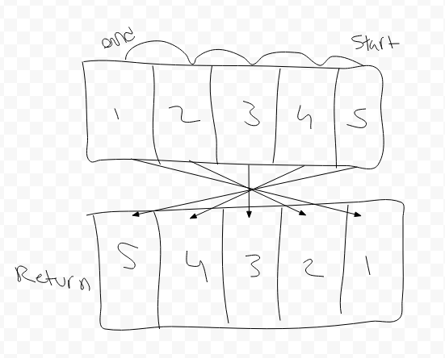

# Reverse an Array
It reverses an array.

## Challenge
Write a function to reverse an array without using any array methods

## Approach & Efficiency
I looped through the input array and created a new array one piece at a time. I did this because it was the first thing that came to mind and was simple. It has a linear cost.

## Solution
