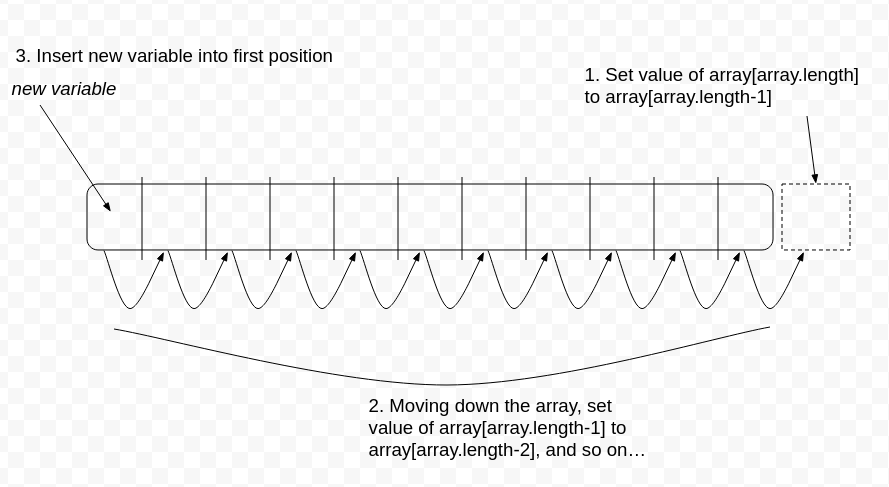

# Shift a value
It inserts a provided value into the first position of an array

## Challenge
Write a function to shift a value into an array without using any array methods

## Approach & Efficiency
Mutating the original array and shifting (ah-hah!) all the values over by one to make room for the new value. Seems to be O(n)...?

## Solution
