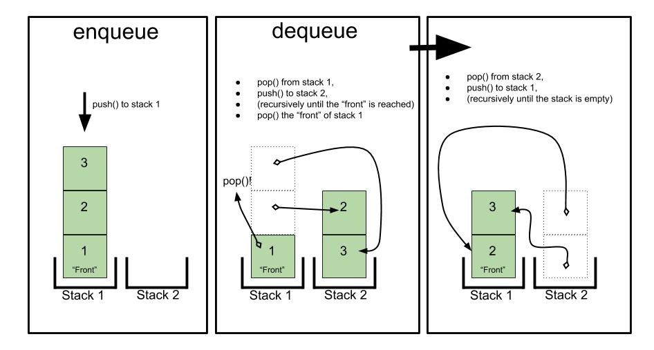

## Queue with stacks
Make a queue with two stacks

## Challenge
Make a PsuedoQueue class that has enqueue and dequeue functionality utilizing only two stacks.

## Approach
Treating one stack as a reversed queue and using the second stack as 'memory'

## Solution
